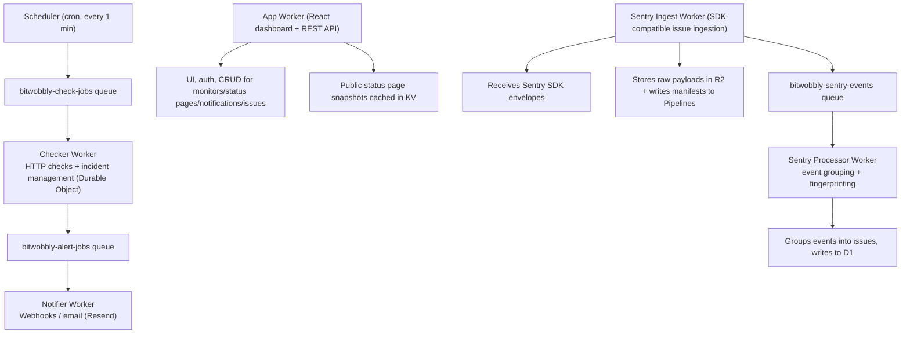

# Bit Wobbly

Open-source website monitoring and public status pages, built entirely on Cloudflare Workers.

> Please Note: This project is in early development and not yet production-ready. Use at your own risk. The plan to get this into production can be seen below.

## Architecture

Multiple Workers collaborate via Cloudflare Queues, Durable Objects, and Pipelines:



### Apps

| App                            | Purpose                                                                                                                                  |
| ------------------------------ | ---------------------------------------------------------------------------------------------------------------------------------------- |
| `apps/app-worker`              | React dashboard + API. Manages monitors, status pages, notification channels, issue tracking projects, and auth.                         |
| `apps/scheduler-worker`        | Cron-triggered dispatcher. Finds due monitors and enqueues check jobs.                                                                   |
| `apps/checker-worker`          | Queue consumer. Performs HTTP checks, tracks failures, opens/resolves incidents via Durable Objects, writes metrics to Analytics Engine. |
| `apps/notifier-worker`         | Queue consumer. Delivers alerts via webhooks and email (Resend API).                                                                     |
| `apps/sentry-ingest-worker`    | Sentry SDK-compatible ingestion endpoint. Parses envelopes, stores raw payloads in R2, publishes to Pipelines and queue.                 |
| `apps/sentry-processor-worker` | Queue consumer. Extracts events from R2, computes fingerprints, groups into issues, writes to D1.                                        |

### Packages

| Package           | Purpose                                                              |
| ----------------- | -------------------------------------------------------------------- |
| `packages/shared` | Drizzle ORM schema (16 tables), database factory, utility functions. |

### External Services

- **Cloudflare D1** -- SQLite database
- **Cloudflare KV** -- status page snapshot cache
- **Cloudflare R2** -- raw Sentry envelope storage
- **Cloudflare Queues** -- job dispatch between workers
- **Cloudflare Pipelines** -- durable ingestion buffering and SQL transformation
- **Cloudflare Durable Objects** -- incident coordination state
- **Cloudflare Analytics Engine** -- latency/uptime metrics
- **Resend** -- transactional email delivery

## Local Development

### Prerequisites

- Node.js 24+
- pnpm 10.27.0 (`corepack enable && corepack prepare pnpm@10.27.0`)

### Quick Start

```bash
pnpm install
pnpm db:migrate:local
pnpm dev
```

This runs all core workers concurrently via Turbo. The dashboard is at `http://localhost:5173`.

### Running Individual Workers

```bash
pnpm dev:app              # Dashboard + API (port 5173)
pnpm dev:scheduler        # Cron dispatcher (port 8788)
pnpm dev:checker          # HTTP checks (port 8787)
pnpm dev:notifier         # Email/webhook alerts
pnpm dev:sentry-ingest    # Sentry SDK ingestion
pnpm dev:sentry-processor # Event grouping
```

### Local State

Wrangler's simulator handles D1, KV, Queues, and Durable Objects locally. State persists in `.data/` at the workspace root.

Cron triggers don't auto-run locally. Test monitors via the "Check Now" button or:

```bash
curl "http://localhost:8788/cdn-cgi/handler/scheduled"
```

### Environment Variables

For email notifications, create `apps/notifier-worker/.dev.vars`:

```
RESEND_API_KEY=re_xxxxx
```

## Deployment

All workers deploy to Cloudflare via Wrangler. See [docs/SETUP.md](docs/SETUP.md) for full resource provisioning steps.
